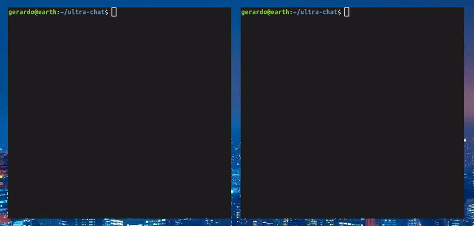

# Ultra Chat

:speech_balloon: A terminal-based chat application written in node.js and socket.io



### Installation
1. Clone the repository and navigate to the directory
    ```bash
    git clone https://github.com/gerardo-torres/ultra-chat.git
    ```
    ```bash
    cd ultra-chat
    ```

2. Install dependencies
    ```bash
    npm install
    ```

3. Start the server
    ```bash
    node server.js
    ```
4. On another terminal, navigate to the directory and start the application
    ```bash
    cd ultra-chat
    ```
    ```bash
    node index.js
    ```

### Dependencies
- socket.io: websocket library
- express: backend server
- blessed: frontend CLI
